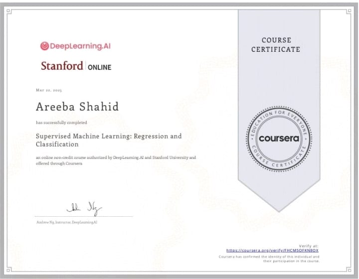

# Supervised Machine Learning: Regression and Classification

## 🏆 Certificate of Completion
**Course:** Supervised Machine Learning: Regression and Classification  
**Institution:** Stanford University (via DeepLearning.AI & Coursera)  
**Instructor:** Andrew Ng  
**Date Completed:** March 22, 2025  
**Certified To:** Areeba Shahid  
**Verify Here:** [Coursera Verification Link](https://coursera.org/verify/HCM5ORNE9XBX)

---

## 📘 Course Overview

This course provided a comprehensive introduction to supervised learning and its core techniques, including:

- **Linear Regression**: Modeling continuous values using input features
- **Logistic Regression**: Binary classification tasks
- **Gradient Descent**: Optimization techniques for minimizing cost functions
- **Overfitting and Regularization**: Improving generalization of ML models
- **Loss Functions**: Understanding and applying different cost functions
- **Multivariate Regression**: Handling multiple features and interactions
- **Evaluation Metrics**: Accuracy, precision, recall, and F1 score

---

## 🧠 Key Takeaways

- Solid understanding of **supervised learning algorithms**
- Application of **regression** and **classification models** to real-world datasets
- Clear grasp of **model evaluation and improvement** techniques
- Use of **Python and NumPy** for implementation of models from scratch

---

## 🛠️ Tools & Libraries

- **Python**
- **NumPy**
- **Jupyter Notebooks**
- **Matplotlib / Seaborn (for visualization)**

---

## 🚀 Next Steps

I’m planning to continue this specialization by exploring:

- Unsupervised Learning
- Neural Networks and Deep Learning
- Machine Learning pipelines in production

---

## 📜 License

This repository is created for educational and portfolio purposes. All content from the course belongs to DeepLearning.AI and Stanford University.
